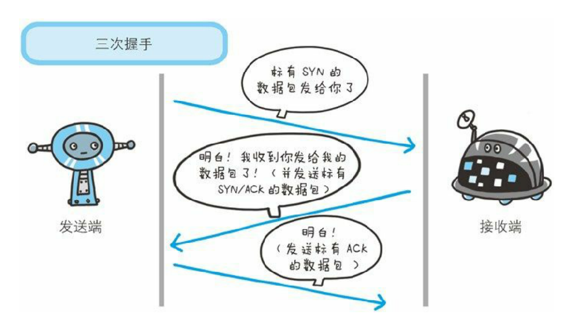
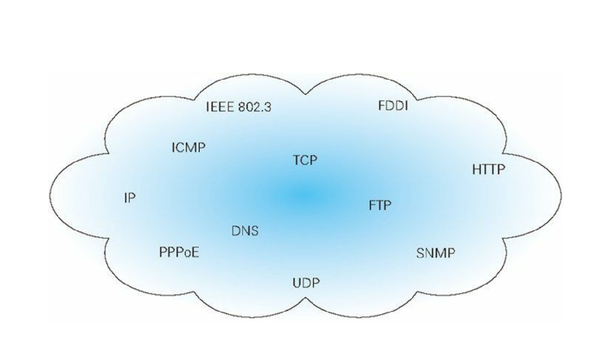
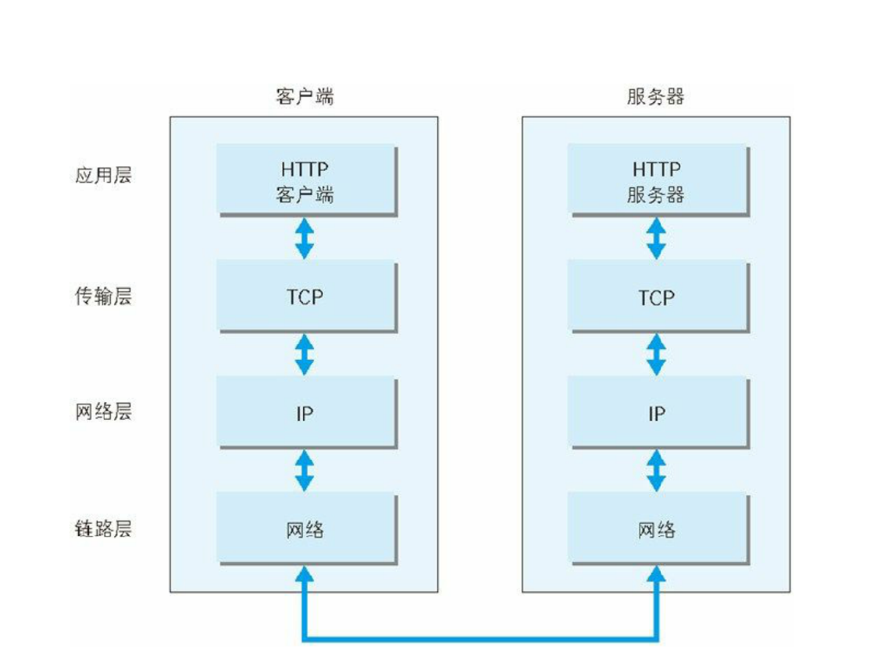
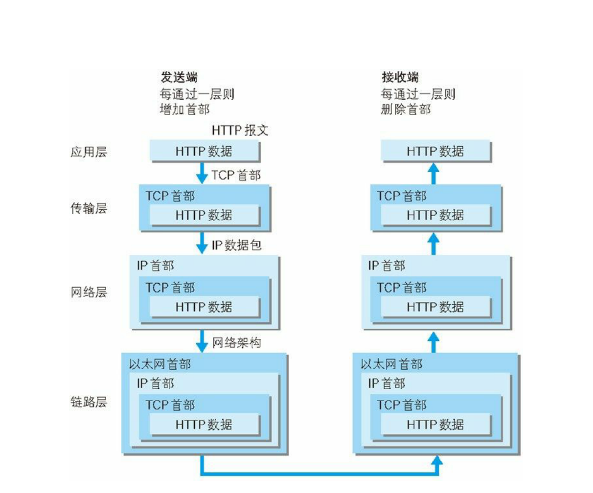
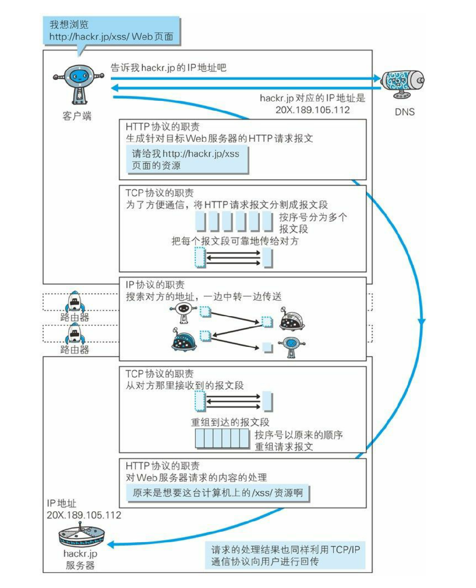
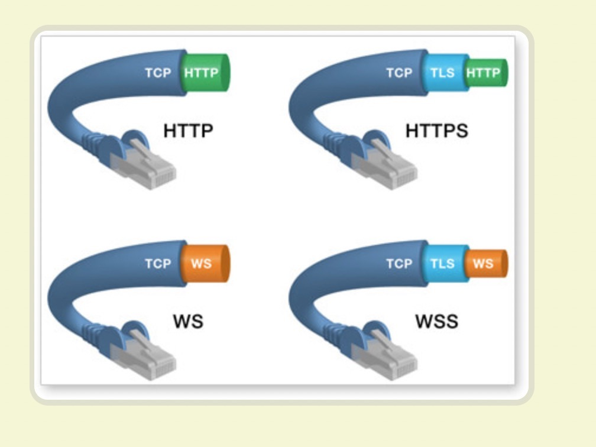
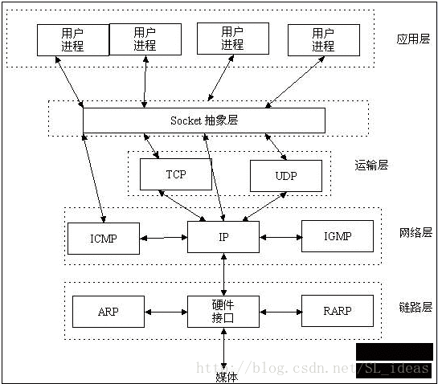
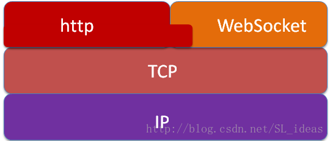

# 报文

# 状态码

# 请求方法

# 首部字段

## 通用首部字段：

Cache-Control：通过指定首部字段 Cache-Control 的指令，就能操作缓存的工作机制。

指令的参数是可选的，多个指令之间通过“,”分隔。首部字段 CacheControl 的指令可用于请求及响应时

Cache-Control: private, max-age=0, no-cache

Connection 首部字段具备如下两个作用。
控制不再转发给代理的首部字段
管理持久连接

在客户端发送请求和服务器返回响应内，使用 Connection 首部字
段，可控制不再转发给代理的首部字段（即 Hop-by-hop 首
部）

HTTP/1.1 版本的默认连接都是持久连接。为此，客户端会在持
久连接上连续发送请求。当服务器端想明确断开连接时，则指定
Connection 首部字段的值为 Close

Date
首部字段 Date 表明创建 HTTP 报文的日期和时


## 请求首部字段

# 确保Web安全的HTTPS
一种方式就是将通信加密。HTTP 协议中没有加密机制，但可以137通过和 SSL（Secure Socket Layer，安全套接层）或TLS（Transport Layer Security，安全层传输协议）的组合使用，加密 HTTP 的通信内容。用 SSL建立安全通信线路之后，就可以在这条线路上进行 HTTP通信了。与 SSL组合使用的 HTTP 被称为 HTTPS（HTTPSecure，超文本传输安全协议）或 HTTP over SS


在 HTTP 协议中有可能存在信息窃听或身份伪装等安全问题。使用
HTTPS 通信机制可以有效地防止这些问题。本章我们就了解一下
HTTPS。


查明对手的证书虽然使用 HTTP 协议无法确定通信方，但如果使用 SSL则可以。SSL不仅提供加密处理，而且还使用了一种被称为证书的手段，可用于确定方。证书由值得信任的第三方机构颁发，用以证明服务器和客户端是实际存在的。另外，伪造证书从技术角度来说是异常困难的一件事。所以只要能够确认通信方（服务器或客户端）持有的证书，即可判断通信方的真实意

HTTP+ 加密 + 认证 + 完整性保护
=HTTPS
7.2.1 HTTP 加上加密处理和认证以及完整性保护后即是
HTTPS


建立连接三次握手🤝

第一次握手

客户端向服务端发送连接请求报文段。该报文段中包含自身的数据通讯初始序号。请求发送后，客户端便进入 SYN-SENT 状态。

第二次握手

服务端收到连接请求报文段后，如果同意连接，则会发送一个应答，该应答中也会包含自身的数据通讯初始序号，发送完成后便进入 SYN-RECEIVED 状态。

第三次握手

当客户端收到连接同意的应答后，还要向服务端发送一个确认报文。客户端发完这个报文段后便进入 ESTABLISHED 状态，服务端收到这个应答后也进入 ESTABLISHED 状态，此时连接建立成功。

PS：第三次握手中可以包含数据，通过快速打开（TFO）技术就可以实现这一功能。其实只要涉及到握手的协议，都可以使用类似 TFO 的方式，客户端和服务端存储相同的 cookie，下次握手时发出 cookie 达到减少 RTT 的目的。

常考面试题：为什么 TCP 建立连接需要三次握手，明明两次就可以建立起连接

因为这是为了防止出现失效的连接请求报文段被服务端接收的情况，从而产生错误。

可以想象如下场景。客户端发送了一个连接请求 A，但是因为网络原因造成了超时，这时 TCP 会启动超时重传的机制再次发送一个连接请求 B。此时请求顺利到达服务端，服务端应答完就建立了请求，然后接收数据后释放了连接。

假设这时候连接请求 A 在两端关闭后终于抵达了服务端，那么此时服务端会认为客户端又需要建立 TCP 连接，从而应答了该请求并进入 ESTABLISHED 状态。但是客户端其实是 CLOSED 的状态，那么就会导致服务端一直等待，造成资源的浪费。

PS：在建立连接中，任意一端掉线，TCP 都会重发 SYN 包，一般会重试五次，在建立连接中可能会遇到 SYN Flood 攻击。遇到这种情况你可以选择调低重试次数或者干脆在不能处理的情况下拒绝请求。


断开链接四次握手


断开链接四次握手

TCP 是全双工的，在断开连接时两端都需要发送 FIN 和 ACK。

第一次握手

若客户端 A 认为数据发送完成，则它需要向服务端 B 发送连接释放请求。

第二次握手

B 收到连接释放请求后，会告诉应用层要释放 TCP 链接。然后会发送 ACK 包，并进入 CLOSE_WAIT 状态，此时表明 A 到 B 的连接已经释放，不再接收 A 发的数据了。但是因为 TCP 连接是双向的，所以 B 仍旧可以发送数据给 A。

第三次握手

B 如果此时还有没发完的数据会继续发送，完毕后会向 A 发送连接释放请求，然后 B 便进入 LAST-ACK 状态。

PS：通过延迟确认的技术（通常有时间限制，否则对方会误认为需要重传），可以将第二次和第三次握手合并，延迟 ACK 包的发送。

第四次握手

A 收到释放请求后，向 B 发送确认应答，此时 A 进入 TIME-WAIT 状态。该状态会持续 2MSL（最大段生存期，指报文段在网络中生存的时间，超时会被抛弃） 时间，若该时间段内没有 B 的重发请求的话，就进入 CLOSED 状态。当 B 收到确认应答后，也便进入 CLOSED 状态。

为什么 A 要进入 TIME-WAIT 状态，等待 2MSL 时间后才进入 CLOSED 状态？

为了保证 B 能收到 A 的确认应答。若 A 发完确认应答后直接进入 CLOSED 状态，如果确认应答因为网络问题一直没有到达，那么会造成 B 不能正常关闭。

## ARQ 协议
ARQ 协议也就是超时重传机制。通过确认和超时机制保证了数据的正确送达，ARQ 协议包含停止等待 ARQ 和连续 ARQ 两种协议。


什么是ack fin


什么时候建立连接 什么时候释放连接 断开连接


宏观看问题-脉络  微观深究细节


TCP(Transmission Control Protocol)传输控制协议

TCP是主机对主机层的传输控制协议，提供可靠的连接服务，采用三次握手确认建立一个连接：

位码即tcp标志位，有6种标示：SYN(synchronous建立联机) ACK(acknowledgement 确认) PSH(push传送) FIN(finish结束) RST(reset重置) URG(urgent紧急)Sequence number(顺序号码) Acknowledge number(确认号码)

第一次握手：主机A发送位码为syn＝1，随机产生seq number=1234567的数据包到服务器，主机B由SYN=1知道，A要求建立联机；

第二次握手：主机B收到请求后要确认联机信息，向A发送ack number=(主机A的seq+1)，syn=1，ack=1，随机产生seq=7654321的包；

第三次握手：主机A收到后检查ack number是否正确，即第一次发送的seq number+1，以及位码ack是否为1，若正确，主机A会再发送ack number=(主机B的seq+1)，ack=1，主机B收到后确认seq值与ack=1则连接建立成功。
————————————————
版权声明：本文为CSDN博主「hmoon729」的原创文章，遵循 CC 4.0 BY-SA 版权协议，转载请附上原文出处链接及本声明。
原文链接：https://blog.csdn.net/u014507230/article/details/45310847

## 确保可靠性的 TCP 协议

> 按层次分，TCP 位于传输层，提供可靠的字节流服务。

所谓的字节流服务（Byte Stream Service）是指，为了方便传输，将大
块数据分割成以报文段（segment）为单位的数据包进行管理。而可
靠的传输服务是指，能够把数据准确可靠地传给对方。一言以蔽之，
TCP 协议为了更容易传送大数据才把数据分割，而且 TCP 协议能够
确认数据最终是否送达到对方。

目的:确保数据能到达

为了准确无误地将数据送达目标处，TCP 协议采用了三次握手
（three-way handshaking）策略。用 TCP 协议把数据包送出去后，TCP
不会对传送后的情况置之不理，它一定会向对方确认是否成功送达。

握手过程中使用了 TCP 的标志（flag） —— SYN（synchronize） 和ACK（acknowledgement


发送端首先发送一个带 SYN 标志的数据包给对方。接收端收到后，
回传一个带有 SYN/ACK 标志的数据包以示传达确认信息。最后，发
送端再回传一个带 ACK 标志的数据包，代表“握手”结束。


这两个都是TCP的标志的数据包
什么是SYN：

什么是ACK：





❗️在TCP层，有个FLAGS字段，这个字段有以下几个标识：SYN, FIN, ACK, PSH, RST, URG.

其中，对于我们日常的分析有用的就是前面的五个字段。 它们的含义是：SYN表示建立连接，FIN表示关闭连接，ACK表示响应，PSH表示有 DATA数据传输，RST表示连接重置。

https://my.oschina.net/u/727148/blog/280183


各种协议与 HTTP 协议的关系


## TCP/IP
什么是TCP/IP协议族
计算机与网络设备要相互通信，双方就必须基于相同的方法。比如，
如何探测到通信目标、由哪一边先发起通信、使用哪种语言进行通
信、怎样结束通信等规则都需要事先确定。不同的硬件、操作系统之
间的通信，所有的这一切都需要一种规则。而我们就把这种规则称为
协议（protocol）


❗️好我们要学的不单单是http协议了



图：TCP/IP 是互联网相关的各类协议族的


也就是网络通信 都是围绕这个TCP/IP 协议（这个大规则进行的 这些大规则有包含很多子规则）进行的 所以这个大概念要知道


### TCP/IP 的分层管理
TCP/IP 协议族里重要的一点就是分层。TCP/IP 协议族按层次分别分
为以下 4 层：应用层、传输层、网络层和数据链路层

要弄清楚谁跟谁 主体很重要


### TCP/IP 通信传输流



利用 TCP/IP 协议族进行网络通信时，会通过分层顺序与对方进行通
信。发送端从应用层往下走，接收端则往应用层往上走。

我们用 HTTP 举例来说明，首先作为发送端的客户端在应用层
（HTTP 协议）发出一个想看某个 Web 页面的 HTTP 请求。
接着，为了传输方便，在传输层（TCP 协议）把从应用层处收到的数
据（HTTP 请求报文）进行分割，并在各个报文上打上标记序号及端
口号后转发给网络层。

在网络层（IP 协议），增加作为通信目的地的 MAC 地址后转发给链
路层。这样一来，发往网络的通信请求就准备齐全了。
接收端的服务器在链路层接收到数据，按序往上层发送，一直到应用
层。当传输到应用层，才能算真正接收到由客户端发送过来的 HTTP
请求





发送端在层与层之间传输数据时，每经过一层时必定会被打上一个该
层所属的首部信息。反之，接收端在层与层传输数据时，每经过一层
时会把对应的首部消去。
这种把数据信息包装起来的做法称为`封装`（encapsulate）


## 与 HTTP 关系密切的协议 : IP、TCP 和DNS

下面我们分别针对在 TCP/IP 协议族中与 HTTP 密不可分的 3 个协议
（IP、TCP 和 DNS）进行说明

### 负责传输的 IP 协议

按层次分，IP（Internet Protocol）网际协议位于网络层。InternetProtocol 这个名称可能听起来有点夸张，但事实正是如此，因为几乎所有使用网络的系统都会用到 IP 协议。TCP/IP 协议族中的 `IP 指的就是网际协议，协议名称中占据了一半位置，其重要性可见一斑`。可能有人会把“IP”和“IP 地址”搞混，“IP”其实是一种协议的名称。·IP 协议的作用是把各种数据包传送给对方。而要保证确实传送到对方那里，则需要满足各类条件·。其中两个重要的条件是 IP 地址和 MAC地址（Media Access Control Address）。IP 地址指明了节点被分配到的地址，MAC 地址是指网卡所属的固定地址。IP 地址可以和 MAC 地址进行配对。IP 地址可变换，但 MAC地址基本上不会更

#### 使用 ARP 协议凭借 MAC 地址进行

IP 间的通信依赖 MAC 地址。在网络上，通信的双方在同一局域网（LAN）内的情况是很少的，通常是经过多台计算机和网络设备中转才能连接到对方。而在进行中转时，会利用下一站中转设备的 MAC地址来搜索下一个中转目标。这时，会采用 ARP 协议（AddressResolution Protocol）。ARP 是一种用以解析地址的协议，根据通信方的 IP 地址就可以反查出对应的 MAC 地


### 确保可靠性的 TCP 协议

按层次分，TCP 位于传输层，提供可靠的字节流服务。所谓的字节流服务（Byte Stream Service）是指，为了方便传输，将大块数据分割成以报文段（segment）为单位的数据包进行管理。而可靠的传输服务是指，能够把数据准确可靠地传给对方。一言以蔽之，TCP 协议为了更容易传送大数据才把数据分割，而且 TCP 协议能够确认数据最终是否送达到对方。确保数据能到达目标为了准确无误地将数据送达目标处，TCP 协议采用了三次握手（three-way handshaking）策略。用 TCP 协议把数据包送出去后，TCP不会对传送后的情况置之不理，它一定会向对方确认是否成功送达。21握手过程中使用了 TCP 的标志（flag） —— SYN（synchronize） 和ACK（acknowledgement）。发送端首先发送一个带 SYN 标志的数据包给对方。接收端收到后，回传一个带有 SYN/ACK 标志的数据包以示传达确认信息。最后，发送端再回传一个带 ACK 标志的数据包，代表“握手”结束。若在握手过程中某个阶段莫名中断，TCP 协议会再次以相同的顺序发送相同的数据


mac地址是唯一的 难怪是

mac地址也就是我们的网卡吧

网卡mac地址


### 各种协议与 HTTP 协议的关系

学习了和 HTTP 协议密不可分的 TCP/IP 协议族中的各种协议后，我
们再通过这张图来了解下 IP 协议、TCP 协议和 DNS 服务在使用
HTTP 协议的通信过程中各自发挥了哪些作用。




HTTP协议职责：
生成针对目标Web服务器的HTTP请求报文
【请给我www.vnues.com的页面资源】

TCP协议的职责：
为了方便通信，讲HTTP的请求报文分割成报文段 （当然还有重组的功能）


IP的协议职责：
搜索对方的地址，一边中转一边传送

## URI 和 URL ---- 简单作为了解 有这么一个东西就行

URL（Uniform Resource Locator，统一资源定位符

URI 用字符串标识某一互联网资源，而 `URL表示资源的地点（互联网上所处的位置）`。可见 URL是 URI 的子集


## ❗️简单的 HTTP 协议

本章将针对 HTTP 协议结构进行讲解，主要使用HTTP/1.1版本。学完
这章，想必大家就能理解 HTTP 协议的基础了。

### HTTP 协议用于客户端和服务器端之间的通信

注意这句话:HTTP 协议用于客户端和服务器端之间的通信

请求访问文本或图像等资源的一端称为客户端，而提供资源响应的一端称为服务


HTTP协议规定：请求从客户端发出，最后服务器端响应应该请求并返回，换句话说，肯定说从客户端开始建立通信的 服务端在没有接收到请求之前是不会发送响应的


❗️❗️❗️请求的资源可以是张图片 HTML页面 音乐🎵、js文件、css文件等等
所以不一定是json数据

### ❗️❗️❗️请求报文

请求报文是由请求方法、请求URI（URL）、协议版本、`可选的请求首部字段和内容实体（❗️❗️❗️内容实体 -->我们想要得到的资源）构成`


### 响应报文

响应报文基本上由协议版本、状态码（表示请求成功或失败的数字代码）、用以解释状态码的原因短语、可选的响应首部字段以及实体主体构成。稍后我们会对这些内容进行详细说


### 请求 URI 定位资源

HTTP 协议使用 URI 定位互联网上的资源。`正是因为 URI 的特定功能，在互联网上任意位置的资源都能访问到。`


当客户端请求访问资源而发送请求时，URI 需要将作为请求报文中的请求 URI 包含在内。指定请求 URI 的方式有很多。


### GET请求

GET ：获取资源
GET 方法用来请求访问已被 URI 识别的资源。指定的资源经服务器
端解析后返回响应内容。也就是说，如果请求的资源是文本，那就保
持原样返回；`如果是像 CGI（Common Gateway Interface，通用网关接口）那样的程序，则返回经过执行后的输出结果`
也就是平时后端写的api接口--猜测的

### POST：传输实体主体
POST 方法用来传输实体的主体。
虽然用 GET 方法也可以传输实体的主体，但一般不用 GET 方法进行
传输，而是用 POST 方法。虽说 POST 的功能与 GET 很相似，但
POST 的主要目的并不是获取响应的主体内容。


### ❗️❗️❗️首部字段 -->里面很多字段代表很多重要的意思

首部字段的作用:

HTTP 首部字段传递重要信息

HTTP 首部字段是构成 HTTP 报文的要素之一。在客户端与服务器之
间以 HTTP 协议进行通信的过程中，无论是请求还是响应都会使用首
部字段，它能起到传递额外重要信息的作用。

使用首部字段是为了给浏览器和服务器提供报文主体大小、所使用的
语言、认证信息等内容。

Connection: Keep-Alive

HTTP/1.1 之前的 HTTP 版本的默认连接都是非持久连接。为
此，如果想在旧版本的 HTTP 协议上维持持续连接，则需要指定
Connection 首部字段的值为 Keep-Ali


都是需要


HTTP
HTTP的地址格式如下：

http_URL = "http:" "//" host [ ":" port ] [ abs_path [ "?" query ]]
协议和host不分大小写
HTTP消息
一个HTTP消息可能是request或者response消息，两种类型的消息都是由开始行（start-line），零个或多个header域，一个表示header域结束的空行（也就是，一个以CRLF为前缀的空行），一个可能为空的消息主体（message-body）。一个合格的HTTP客户端不应该在消息头或者尾添加多余的CRLF，服务端也会忽略这些字符


WebSocket
只从RFC发布的时间看来，WebSocket要晚近很多，HTTP 1.1是1999年，WebSocket则是12年之后了。WebSocket协议的开篇就说，本协议的目的是为了解决基于浏览器的程序需要拉取资源时必须发起多个HTTP请求和长时间的轮训的问题……而创建的。--- ❗️这个理解很重要


想想我们做轮询的时候http请求

那么就会带来一个问题 一直在请求这个接口

还不如一直保持这个接口通信 而且要求实时


### HTTP长连接和短连接
1. HTTP协议与TCP/IP协议的关系

　　HTTP的长连接和短连接本质上是TCP长连接和短连接。HTTP属于应用层协议，在传输层使用TCP协议，在网络层使用IP协议。IP协议主要解决网络路由和寻址问题，TCP协议主要解决如何在IP层之上可靠的传递数据包，使在网络上的另一端收到发端发出的所有包，并且顺序与发出顺序一致。TCP有可靠，面向连接的特点。

 

2. 如何理解HTTP协议是无状态的

　　HTTP协议是无状态的，指的是协议对于事务处理没有记忆能力，服务器不知道客户端是什么状态。也就是说，打开一个服务器上的网页和你之前打开这个服务器上的网页之间没有任何联系。HTTP是一个无状态的面向连接的协议，无状态不代表HTTP不能保持TCP连接，更不能代表HTTP使用的是UDP协议（无连接）。


3. 什么是长连接、短连接？

在HTTP/1.0中，默认使用的是短连接。也就是说，浏览器和服务器每进行一次HTTP操作，就建立一次连接，但任务结束就中断连接。如果客户端浏览器访问的某个HTML或其他类型的 Web页中包含有其他的Web资源，如JavaScript文件、图像文件、CSS文件等；当浏览器每遇到这样一个Web资源，就会建立一个HTTP会话。

但从 HTTP/1.1起，默认使用长连接，用以保持连接特性。使用长连接的HTTP协议，会在响应头有加入这行代码：

`Connection:keep-alive`

　　在使用长连接的情况下，当一个网页打开完成后，客户端和服务器之间用于传输HTTP数据的 TCP连接不会关闭，如果客户端再次访问这个服务器上的网页，会继续使用这一条已经建立的连接。Keep-Alive不会永久保持连接，它有一个保持时间，可以在不同的服务器软件（如Apache）中设定这个时间。实现长连接要客户端和服务端都支持长连接。

HTTP协议的长连接和短连接，实质上是TCP协议的长连接和短连接。


什么时候用长连接，短连接？ 
 　　长连接多用于操作频繁，点对点的通讯，而且连接数不能太多情况，。每个TCP连接都需要三步握手，这需要时间，如果每个操作都是先连接，再操作的话那么处理速度会降低很多，所以每个操作完后都不断开，次处理时直接发送数据包就OK了，不用建立TCP连接。例如：数据库的连接用长连接， 如果用短连接频繁的通信会造成socket错误，而且频繁的socket 创建也是对资源的浪费。 
  
　　而像WEB网站的http服务一般都用短链接，因为长连接对于服务端来说会耗费一定的资源，而像WEB网站这么频繁的成千上万甚至上亿客户端的连接用短连接会更省一些资源，如果用长连接，而且同时有成千上万的用户，如果每个用户都占用一个连接的话，那可想而知吧。所以并发量大，但每个用户无需频繁操作情况下需用短连好。

https://www.cnblogs.com/0201zcr/p/4694945.html


3.4 长连接短连接操作过程

短连接的操作步骤是：
建立连接——数据传输——关闭连接...建立连接——数据传输——关闭连接
长连接的操作步骤是：
建立连接——数据传输...（保持连接）...数据传输——关闭连接


1.以前的误解
很久之前就听说过长连接的说法，而且还知道HTTP1.0协议不支持长连接，从HTTP1.1协议以后，连接默认都是长连接。但终究觉得对于长连接一直懵懵懂懂的，有种抓不到关键点的感觉。

今天通过一番研究，终于明白了这其中的奥秘。而之前，也看过长连接相关的内容，但一直都是云里雾里的。`这次之所以能在这么短的时间里搞清楚，和自己技术的沉淀密不可分。因此，这里借着这个机会，再次强调一下，千万不要试图去研究你研究了很久都整不明白的东西，或许是你的层次不到，也或许是你从未在实际的应用场景接触过，这种情况下你去研究，只会事倍功半，徒劳一番罢了`


那就是一直认为，HTTP连接分为长连接和短连接，而我们现在常用的都是HTTP1.1，因此我们用的都是长连接。

这句话其实只对了一半，我们现如今的HTTP协议，大部分都是1.1的，因此我们平时用的基本上都是长连接。但是前半句是不对的，HTTP协议根本没有长短连接这一说，也正因为误解了这个，导致对于长连接一直不明不白，始终不得其要领，具体下面一段会说到。

`网络上很多文章都是误人子弟，根本没有说明白这个概念。这里要强调一下，HTTP协议是基于请求/响应模式的，因此只要服务端给了响应，本次HTTP连接就结束了，或者更准确的说，是本次HTTP请求就结束了，根本没有长连接这一说。那么自然也就没有短连接这一说了。`

`之所以网络上说HTTP分为长连接和短连接，其实本质上是说的TCP连接。TCP连接是一个双向的通道，它是可以保持一段时间不关闭的，因此TCP连接才有真正的长连接和短连接这一说。`

其实知道了以后，会觉得这很好理解。HTTP协议说到底是应用层的协议，而TCP才是真正的传输层协议，只有负责传输的这一层才需要建立连接。


连接是传输层定义的 http协议是应用层

所以说哪里来的http长连接 短连接


这也是错误的叫法 但听到别人说HTTP长连接 短连接 就是要马上知道 其实他们在说TCP长连接、短连接


WebSocket
只从RFC发布的时间看来，WebSocket要晚近很多，HTTP 1.1是1999年，WebSocket则是12年之后了。WebSocket协议的开篇就说，本协议的目的是为了解决基于浏览器的程序需要拉取资源时必须发起多个HTTP请求和长时间的轮训的问题……而创建的。--- ❗️这个理解很重要


WebSocket的出现就是为了解决HTTP的缺点

当然它是新的协议

https://www.jianshu.com/p/3fc3646fad80


　HTTP的长连接和短连接本质上是TCP长连接和短连接。 --->❗️❗️❗️这句理解很重要 -->可以用来面试


❗️❗️❗️对了 单点登录和token jwt得去弄熟悉来❗️❗️❗️免得面试问这个被人笑话


xss攻击 比如表单 吧、评论功能 是全部用户可以看到的 并且我们输入的内容可以操作

只要做点手脚 自然影响页面 而这页面所有用户都能看到 也就有了危险❗️❗️❗️原来弄不懂的概念是这样

我一直很好奇 我这边操作怎么去影响别的用户 是因为我们这个页面所有用户都能看到 而不是私密的 没有权限的


### xss攻击
```javascript

      <div v-html="AdRecords.remark"></div>
      `<a onclick='alert("xss攻击")'>链接</a>`
   
```
假设onclick==》触发一个请求 请求到一个钓鱼网站 然后把我们这个网站的cookie传递过去  （这个网站允许跨域就行）

也就是有风险了

跨站脚本攻击（Cross-Site Scripting，XSS）是指通过存在安全漏洞的
Web 网站注册用户的浏览器内运行非法的 HTML标签或 JavaScript 进
行的一种攻击。动态创建的 HTML部分有可能隐藏着安全漏洞。就
这样，攻击者编写脚本设下陷阱，用户在自己的浏览器上运行时，一
不小心就会受到被动攻击。
跨站脚本攻击有可能造成以下影响。
利用虚假输入表单骗取用户个人信息。
利用脚本窃取用户的 Cookie 值，被害者在不知情的情况下，
帮助攻击者发送恶意请求。
显示伪造的文章或图片。
跨站脚本攻击案例
在动态生成 HTML 处发生
下面以编辑个人信息页面为例讲解跨站脚本攻击。下方界面显示
了用户输入的个人信息内容


把token带过去 别人也是有办法解析拿到的

同源检测
既然CSRF大多来自第三方网站，那么我们就直接禁止外域（或者不受信任的域名）对我们发起请求。
那么问题来了，我们如何判断请求是否来自外域呢？
在HTTP协议中，每一个异步请求都会携带两个Header，用于标记来源域名：

Origin Header
Referer Header

这两个Header在浏览器发起请求时，大多数情况会自动带上，并且不能由前端自定义内容。
服务器可以通过解析这两个Header中的域名，确定请求的来源域。

作者：美团技术团队
链接：https://juejin.im/post/5bc009996fb9a05d0a055192
来源：掘金
著作权归作者所有。商业转载请联系作者获得授权，非商业转载请注明出处。


### 前端安全系列之二：如何防止CSRF攻击？

> gmail邮件理解


第三方网站拿到我们的token然后发起请求


### 什么是CSRF
CSRF（Cross-site request forgery）跨站请求伪造：攻击者诱导受害者进入第三方网站，在第三方网站中，向被攻击网站发送跨站请求。利用受害者在被攻击网站已经获取的注册凭证，绕过后台的用户验证，达到冒充用户对被攻击的网站执行某项操作的目的。
一个典型的CSRF攻击有着如下的流程：

受害者登录a.com，并保留了登录凭证（Cookie）。
攻击者引诱受害者访问了b.com。
b.com 向 a.com 发送了一个请求：a.com/act=xx。浏览器会…
a.com接收到请求后，对请求进行验证，并确认是受害者的凭证，误以为是受害者自己发送的请求。
a.com以受害者的名义执行了act=xx。
攻击完成，攻击者在受害者不知情的情况下，冒充受害者，让a.com执行了自己定义的操作。

作者：美团技术团队
链接：https://juejin.im/post/5bc009996fb9a05d0a055192
来源：掘金
著作权归作者所有。商业转载请联系作者获得授权，非商业转载请注明出处。

10.没理清楚需求就写代码很多人在接到需求之后，第一反应就是写代码，即使是在自己没把需求理清楚之前也是照样写代码。另一种情况就是，很多人是边写代码，边想需求。这个开发方式，万一自己对需求理解有误！可能会导致自己写的代码，很大一部分都要修改，甚至是全部删除重写。没理清楚需求就写代码这个情况，发生的概率应该挺大的，但是一般来说很难发现这个情况，毕竟程序员对代码的增删改查是再正常不过了！我本身也不知道，就是在一次的技术分享中，老大提出来的，他的建议就是对于一些稍微复杂一点的需求，先理清楚需求，简单画个流程图，然后在代码里面，先写上一点注释，再开始动手写代码！对于这一点，我现在就是在执行当中！除非需求真的很简单，否则我都会在草稿本上简单画一下流程图。比如下面这个，这个已经是我画的流程图里比较简单的一个了。根据流程图，写好注释，再写代码，这样会比较有条理，代码也清晰，日后的返工也可能会有，但是不会像以前那么多！在开发时间上，效率上，都得到了一个提升！

作者：守候i
链接：https://juejin.im/post/59bf2a1d51882531b730b718
来源：掘金
著作权归作者所有。商业转载请联系作者获得授权，非商业转载请注明出处。

✅ 确实


`你可以把 WebSocket 看成是 HTTP 协议为了支持长连接所打的一个大补丁，它和 HTTP 有一些共性，是为了解决 HTTP 本身无法解决的某些问题而做出的一个改良设计`。在以前 HTTP 协议中所谓的 keep-alive connection 是指在一次 TCP 连接中完成多个 HTTP 请求，但是对每个请求仍然要单独发 header；所谓的 polling 是指从客户端（一般就是浏览器）不断主动的向服务器发 HTTP 请求查询是否有新数据。这两种模式有一个共同的缺点，就是除了真正的数据部分外，服务器和客户端还要大量交换 HTTP header，信息交换效率很低。它们建立的“长连接”都是伪.长连接，只不过好处是不需要对现有的 HTTP server 和浏览器架构做修改就能实现。WebSocket 解决的第一个问题是，通过第一个 HTTP request 建立了 TCP 连接之后，之后的交换数据都不需要再发 HTTP request了，使得这个长连接变成了一个真.长连接。但是不需要发送 HTTP header就能交换数据显然和原有的 HTTP 协议是有区别的，所以它需要对服务器和客户端都进行升级才能实现。在此基础上 WebSocket 还是一个双通道的连接，在同一个 TCP 连接上既可以发也可以收信息。此外还有 multiplexing 功能，几个不同的 URI 可以复用同一个 WebSocket 连接。这些都是原来的 HTTP 不能做到的。另外说一点技术细节，因为看到有人提问 WebSocket 可能进入某种半死不活的状态。这实际上也是原有网络世界的一些缺陷性设计。上面所说的 WebSocket 真.长连接虽然解决了服务器和客户端两边的问题，但坑爹的是网络应用除了服务器和客户端之外，另一个巨大的存在是中间的网络链路。一个 HTTP/WebSocket 连接往往要经过无数的路由，防火墙。你以为你的数据是在一个“连接”中发送的，实际上它要跨越千山万水，经过无数次转发，过滤，才能最终抵达终点。在这过程中，中间节点的处理方法很可能会让你意想不到。比如说，这些坑爹的中间节点可能会认为一份连接在一段时间内没有数据发送就等于失效，它们会自作主张的切断这些连接。在这种情况下，不论服务器还是客户端都不会收到任何提示，它们只会一厢情愿的以为彼此间的红线还在，徒劳地一边又一边地发送抵达不了彼岸的信息。而计算机网络协议栈的实现中又会有一层套一层的缓存，除非填满这些缓存，你的程序根本不会发现任何错误。这样，本来一个美好的 WebSocket 长连接，就可能在毫不知情的情况下进入了半死不活状态。而解决方案，WebSocket 的设计者们也早已想过。就是让服务器和客户端能够发送 Ping/Pong Frame（RFC 6455 - The WebSocket Protocol）。这种 Frame 是一种特殊的数据包，它只包含一些元数据而不需要真正的 Data Payload，可以在不影响 Application 的情况下维持住中间网络的连接状态。

作者：腾讯云技术社区
链接：https://www.zhihu.com/question/20215561/answer/157908509
来源：知乎
著作权归作者所有。商业转载请联系作者获得授权，非商业转载请注明出处。

众所周知，Web应用的通信过程通常是客户端通过浏览器发出一个请求，服务器端接收请求后进行处理并返回结果给客户端，客户端浏览器将信息呈现。这种机制对于信息变化不是特别频繁的应用可以良好支撑，但对于实时要求高、海量并发的应用来说显得捉襟见肘，尤其在当前业界移动互联网蓬勃发展的趋势下，高并发与用户实时响应是Web应用经常面临的问题，比如金融证券的实时信息、Web导航应用中的地理位置获取、社交网络的实时消息推送等。传统的请求-响应模式的Web开发在处理此类业务场景时，通常采用实时通讯方案。比如常见的轮询方案，其原理简单易懂，就是客户端以一定的时间间隔频繁请求的方式向服务器发送请求，来保持客户端和服务器端的数据同步。其问题也很明显：当客户端以固定频率向服务器端发送请求时，服务器端的数据可能并没有更新，带来很多无谓请求，浪费带宽，效率低下。基于Flash，AdobeFlash通过自己的Socket实现完成数据交换，再利用Flash暴露出相应的接口给JavaScript调用，从而达到实时传输目的。此方式比轮询要高效，且因为Flash安装率高，应用场景广泛。然而，移动互联网终端上Flash的支持并不好：IOS系统中无法支持Flash，Android虽然支持Flash但实际的使用效果差强人意，且对移动设备的硬件配置要求较高。2012年Adobe官方宣布不再支持Android4.1+系统，宣告了Flash在移动终端上的死亡。传统的Web模式在处理高并发及实时性需求的时候，会遇到难以逾越的瓶颈，需要一种高效节能的双向通信机制来保证数据的实时传输。在此背景下，基于HTML5规范的、有Web TCP之称的 WebSocket应运而生。早期HTML5并没有形成业界统一的规范，各个浏览器和应用服务器厂商有着各异的类似实现，如IBM的MQTT、Comet开源框架等。直到2014年，HTML5终于尘埃落地，正式落实为实际标准规范，各个应用服务器及浏览器厂商逐步开始统一，在 JavaEE7中也实现了WebSocket协议。至此无论是客户端还是服务端的WebSocket都已完备。用户可以查阅HTML5规范，熟悉新的HTML协议规范及WebSocket支持。


你说说 WebSocket是应用层还是传输层的？

WebSocket 机制以下简要介绍一下WebSocket的原理及运行机制。WebSocket是HTML5下一种新的协议。它实现了浏览器与服务器全双工通信，能更好的节省服务器资源和带宽并达到实时通讯的目的。它与HTTP一样通过已建立的TCP连接来传输数据，但是它和HTTP最大不同是：WebSocket是一种双向通信协议。在建立连接后，WebSocket服务器端和客户端都能主动向对方发送或接收数据，就像Socket一样；WebSocket需要像TCP一样，先建立连接，连接成功后才能相互通信。

作者：腾讯云技术社区
链接：https://www.zhihu.com/question/20215561/answer/157908509
来源：知乎
著作权归作者所有。商业转载请联系作者获得授权，非商业转载请注明出处。


肯定是应用层协议 传输还是得依靠TCP协议 `WebSocket就像HTTP一样，则是一个典型的应用层协议 ` 对 确实没错
1

WebSocket 协议在2008年诞生，2011年成为国际标准。所有浏览器都已经支持了。


HTML5出来后 WebSocket也是他其中的标准

> 它的最大特点就是，服务器可以主动向客户端推送信息，客户端也可以主动向服务器发送信息，是真正的双向平等对话，属于服务器推送技术的一种。


对 这句话精辟  也是我所理解的 因为HTTP是客户端向服务端发起的 虽然服务端可以把信息发给客户端但是是依赖客户端发起一次请求的
而他做出响应  我们想让服务端主动发起请求 

其他特点包括：

（1）建立在 TCP 协议之上，服务器端的实现比较容易。

（2）与 HTTP 协议有着良好的兼容性。默认端口也是80和443，并且握手阶段采用 HTTP 协议，因此握手时不容易屏蔽，能通过各种 HTTP 代理服务器。

（3）数据格式比较轻量，性能开销小，通信高效。

（4）可以发送文本，也可以发送二进制数据。

（5）没有同源限制，客户端可以与任意服务器通信。

（6）协议标识符是ws（如果加密，则为wss），服务器网址就是 URL




```javascript

var ws = new WebSocket("wss://echo.websocket.org");


```

可见HTML5给我们带来看诸多特性

```javascript


ws.onopen = function(evt) { 
  console.log("Connection open ..."); 
  ws.send("Hello WebSockets!");
};

ws.onmessage = function(evt) {
  console.log( "Received Message: " + evt.data);
  ws.close();
};

ws.onclose = function(evt) {
  console.log("Connection closed.");
};  


```

ajax跟http

好像没什么比较  就算以前ajax这个技术没出来 光靠表单post（会引起刷新）也是需要HTTP协议的  HTTP协议就是通信的协议基础  你要这样想 而ajax这种技术给我们带来的好处 就是局部更新  不会引起整张页面的刷新  交互体验性友好了


但是我们浏览器（web应用）默认都是走http协议、所以我们得声明式指向我们这次的通信是或者这次请求是WebSocket

当然服务端也得要做相应的指向这次协议是WebSocket


一、为什么需要 WebSocket？
初次接触 WebSocket 的人，都会问同样的问题：我们已经有了 HTTP 协议，为什么还需要另一个协议？它能带来什么好处？

答案很简单，因为 HTTP 协议有一个缺陷：通信只能由客户端发起。

举例来说，我们想了解今天的天气，只能是客户端向服务器发出请求，服务器返回查询结果。HTTP 协议做不到服务器主动向客户端推送信息

WebSocket教程：http://www.ruanyifeng.com/blog/2017/05/websocket.html


WebSocket是HTML5中的协议。HTML5 Web Sockets规范定义了Web Sockets API，支持页面使用Web Socket协议与远程主机进行全双工的通信。它引入了WebSocket接口并且定义了一个全双工的通信通道，通过一个单一的套接字在Web上进行操作。HTML5 Web Sockets以最小的开销高效地提供了Web连接。相较于经常需要使用推送实时数据到客户端甚至通过维护两个HTTP连接来模拟全双工连接的旧的轮询或长轮询（Comet）来说，这就极大的减少了不必要的网络流量与延迟。

————————————————
版权声明：本文为CSDN博主「SL_ideas」的原创文章，遵循 CC 4.0 BY-SA 版权协议，转载请附上原文出处链接及本声明。
原文链接：https://blog.csdn.net/SL_ideas/article/details/73648378


一、WebSocket 是什么？
WebSocket是HTML5规范提出的一种协议；目前除了完犊子的IE浏览器，其他浏览器都基本支持。他是一种协议，万变不离其宗，也是基于TCP协议的；和HTTP协议是并存的两种协议。
WebSocket是HTML5中的协议。HTML5 Web Sockets规范定义了Web Sockets API，支持页面使用Web Socket协议与远程主机进行全双工的通信。它引入了WebSocket接口并且定义了一个全双工的通信通道，通过一个单一的套接字在Web上进行操作。HTML5 Web Sockets以最小的开销高效地提供了Web连接。相较于经常需要使用推送实时数据到客户端甚至通过维护两个HTTP连接来模拟全双工连接的旧的轮询或长轮询（Comet）来说，这就极大的减少了不必要的网络流量与延迟。
要使用HTML5 Web Sockets从一个Web客户端连接到一个远程端点，你要创建一个新的WebSocket实例并为之提供一个URL来表示你想要连接到的远程端点。该规范定义了ws://以及wss://模式来分别表示WebSocket和安全WebSocket连接,这就跟http:// 以及https:// 的区别是差不多的。一个WebSocket连接是在客户端与服务器之间HTTP协议的初始握手阶段将其升级到Web Socket协议来建立的，其底层仍是TCP/IP连接。
————————————————


二、WebSocket与Socket的关系

Socket其实并不是一个协议，而是为了方便使用TCP或UDP而抽象出来的一层，是位于应用层和传输控制层之间的一组接口。

“Socket是应用层与TCP/IP协议族通信的中间软件抽象层，它是一组接口，提供一套调用TCP/IP协议的API。在设计模式中，Socket其实就是一个门面模式，它把复杂的TCP/IP协议族隐藏在Socket接口后面，对用户来说，一组简单的接口就是全部，让Socket去组织数据，以符合指定的协议。”

当两台主机通信时，必须通过Socket连接，Socket则利用TCP/IP协议建立TCP连接。TCP连接则更依靠于底层的IP协议，IP协议的连接则依赖于链路层等更低层次。

`WebSocket就像HTTP一样，则是一个典型的应用层协议。`




### Socket是传输控制层接口，WebSocket是应用层协议。





相同点

1. 都是一样基于TCP的，都是可靠性传输协议。
2. 都是应用层协议。
1
2
不同点

 1. WebSocket是双向通信协议，模拟Socket协议，可以双向发送或接受信息。HTTP是单向的。
 2. WebSocket是需要浏览器和服务器握手进行建立连接的。而http是浏览器发起向服务器的连接，服务器预先并不知道这个连接。
1
2
联系

WebSocket在建立握手时，数据是通过HTTP传输的。但是建立之后，在真正传输时候是不需要HTTP协议的。
1
总结：
在WebSocket中，只需要服务器和浏览器通过HTTP协议进行一个握手的动作，然后单独建立一条TCP的通信通道进行数据的传送。
WebSocket连接的过程是：

首先，客户端发起http请求，经过3次握手后，建立起TCP连接；http请求里存放WebSocket支持的版本号等信息，如：Upgrade、Connection、WebSocket-Version等；
然后，服务器收到客户端的握手请求后，同样采用HTTP协议回馈数据；
最后，客户端收到连接成功的消息后，开始借助于TCP传输信道进行全双工通信。
————————————————


❗️❗️❗️问题来了WebSocket怎建立起连接的


WebSocket连接的过程是：

首先，`客户端发起http请求，经过3次握手后`，建立起TCP连接；`http请求里存放WebSocket支持的版本号等信息`，如：Upgrade、Connection、WebSocket-Version等；
然后，服务器收到客户端的握手请求后，同样采用HTTP协议回馈数据；
最后，客户端收到连接成功的消息后，开始借助于TCP传输信道进行全双工通信。

传输层是TCP 还是经过三次握手建立起连接的  <----------- 原来是这样


https://blog.csdn.net/SL_ideas/article/details/73648378 这篇文章也非常 不错 但是我们看的都是别人的二手文章  来去官网文档了解下吧


MDN:

WebSocket 是一种在客户端与服务器之间保持TCP长连接的网络协议，这样它们就可以随时进行信息交换。

虽然任何客户端或服务器上的应用都可以使用WebSocket，但原则上还是指浏览器与服务器之间使用。通过WebSocket，服务器可以直接向客户端发送数据，而无须客户端周期性的请求服务器，以动态更新数据内容。


好了顺便把token JWT 单点登录的问题解决了

