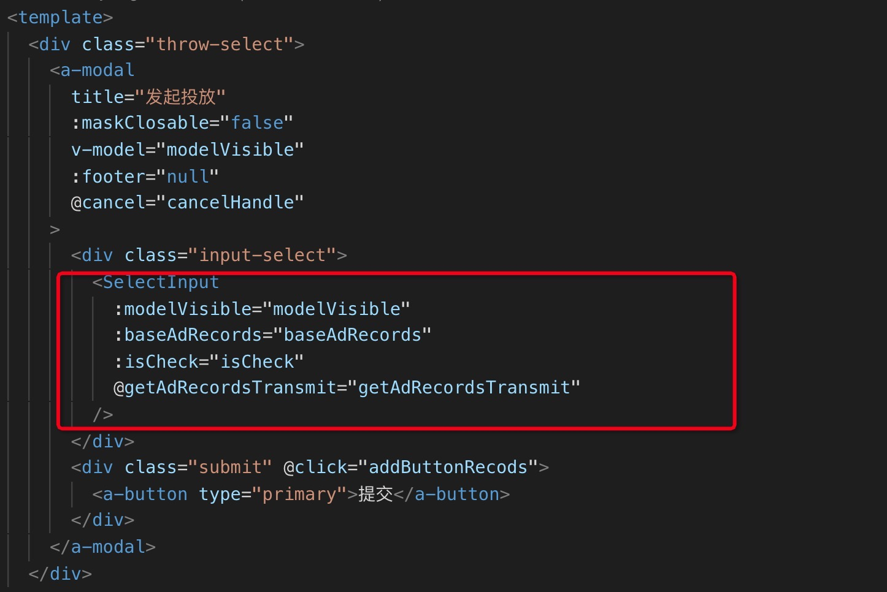
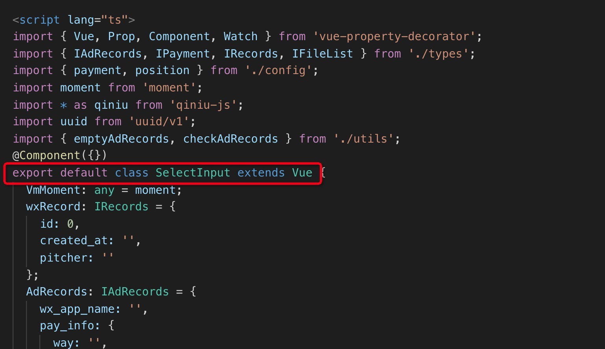
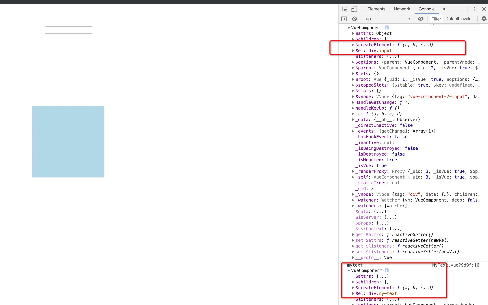

### 什么是父子组件与绑定



以前认为红色边框是SelectInput是父组件




子组件是这里面SelectInput的代码


为什么会有这种错误的认知呢

因为当时我是这样认为的
```
   <SelectInput
             :a="modelVisible"
             :b="baseAdRecords"
             :isCheck="isCheck"
             @getAdRecordsTransmit="getAdRecordsTransmit"
   />
```
父组件给子组件传递方法 父组件自定义方法实现父子通信 所以我认为此块是父组件


实际上我们应该这样想 为什么我这样写<SelectInput class="select" />的时候我们的
打开谷歌调试工具 SelectInput组件会出现了样式名 这不还说明<SelectInput class="select" />是子组件
所以我们赋予SelectInput组件是绑定给子组件<SelectInput class="select" />的，比如getAdRecordsTransmit自定义事件是属于
子组件的自定义事件而不是属于父组件的 变量a也是赋予子组件的也是属于子组件的 有的是直接接收比如方法
有的是通过prop接收 

是谁给的不重要 也没必要去关心 我们只关心父子组件是谁 是什么 哪些属性是属于子组件的 要明确

一句话绑定给子组件的属性 不是子组件的 那是谁的❗️❗️❗️

注意emit是这样定义的：触发当前实例上的事件。附加参数都会传给监听器回调。
             
什么是当前实例 为什么我在父组件触发getAdRecordsTransmit根本没有触发getAdRecordsTransmit回调函数
那是因为emit确实触发了getAdRecordsTransmit，但是这个getAdRecordsTransmit不是子组件的getAdRecordsTransmit
所以当然触发不了，emit只触发当前实例 所以更加证明啦❗️❗️❗️

### bus替代vuex

也就是我们在这个组件上触发一个事件（自定义事件），我们去监听它就像（至于事件有没有注册 存不存在，好像触发emit就帮我们自动注册了，我猜测的）

我们只要把vue实例注册到全局实现了全局的触发跟监听 就实现了全局变量管理了


### 还有一个问题 你说不同的组件里面的this是不是不同啊 打印试一下

确实不同

那么问题来了

```vue
   var bus = new Vue()
   var eventBus = {
     install(Vue, options) {
       // 注册到原型上去 就可以直接使用this.xxx
       Vue.prototype.$bus = bus
     }
   }
   
   Vue.use(eventBus)
```
```vue
<div id="app-5">
  <p>{{ message }}</p>
  <button v-on:click="reverseMessage">反转消息</button>
</div>

var app6 = new Vue({
  el: '#app-6',
  data: {
    message: 'Hello Vue!'
  }
})

```
为什么可以全局拿到this.$bus  我猜每个this 都是new Vue生成的 实际上就是 然后就是会继承原型上的属性
说是继承 还不如说引用 指向了原型对象 所以this.$bus才可以拿到  果然是hack技术啊

javascript学好确实很重要

那么接下来看看new Vue发生了什么

通过bus event来实现组件通信好像是UI框架的实现原理

/*
忽略
### react拓展
withRouter是个高阶组件路由实现响应可以通过componentWillReceiveProps去实现
*/

https://juejin.im/post/5cb3eed65188251b0351f2c4#heading-9

### vue单向数据流

### 什么是vue双向数据绑定 跟vue单向数据流有什么区别
