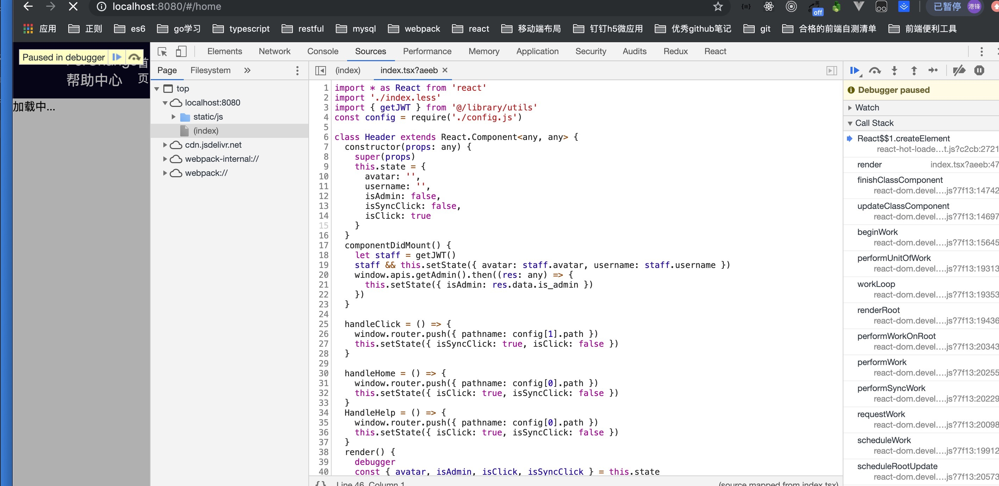
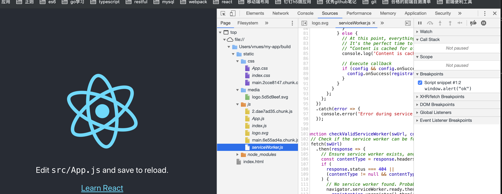

### 模块化

> 模块化是指将多个复杂的系统分解为多个模块以方便编码

### 立即执行函数(命名空间)

命名空间冲突，两个库可能会使用同一个名称，例如 Zepto ( http: // zeptojs.com ）也
被放在 winndow.$ 下：

无法合理地管理项目的依赖和版本

无法方便地控制依赖的加载顺序。

❗️❗️❗️当项目变大时 ，这种方式将变得难以维护，需要用模块化的思想来组织代码。

 ### CommonJS 
CommonJS ( http: //www.commonjs.org ）是一种被广泛使用的 JavaScript 模块化规范，其
核心思想是通过 require 方法来同步加载依赖的其他模块，通过 module.exports 出需
要暴露的接口。 CommonJS 规范的流行得益于 Node.js 采用了这种方式，后来这种方式被引入
• 2 • 
到了网页开发中。

### AMD

AMD 的缺点在于 JavaScript 运行环境没有原生支持 岛。， 需要先导入实现了 AMD 的库
后才能正常使用。

## ES6模块化

ES6 模块化是国际标准化组织 ECMA 提出的 JavaScript 模块化规范，它在语言层面上实
现了模块化。浏览器厂商和 Nodejs 都宣布要原生支持该规范 它将逐渐取代 CommonJS
AMD 规范，成为浏览器和服务器通用的模块解决方案

ES6 模块虽然是终极模块化方案，但它的缺点在于目前无法直接运行在大部分 JavaScript
运行环境下，必须通过工具转换成标准的 ES5 后才能正常运行。

通过Commonjs的规范来实现es6模块化

❗️❗️❗️原来我认知的模块化不单单只是把一个js文件就当做一个模块

模快不是代表模块化

模块化是：-、命名空间 变量不污染 二、合理地管理项目的依赖和版本 三、方便地控制依赖的加载顺序  得满足以上的点才可以叫模块化

而命名空间显然不是 只是模块化的雏形  模块化含义的认知很重要

而不是单单认为不污染各自变量就行   二、合理地管理项目的依赖和版本 三、方便地控制依赖的加载顺序  这两个点更重要

学一个东西前 得弄清楚概念！！！

### 常见的构建工具及对比

> 为什么需要构建？
在阅读完后，我们一定会感叹前端技术发展之快，各种可以提高开发效率的新思
想和框架层出不穷。但是它们都有一个共同点 源代码无法直接运行，必须通过转换后才可
以正常运行。

构建就是做这件事情，将源代码转换成可执行 的JavaScript css HTML 代码

构建做这些事情:

•代码转换：将 TypeScript 编译成 JavaScript 、将 scss 编译成 css 等。
• 文件优化：压缩 JavaScript css HT鸟也代码，压缩合并图片等。
• 代码分割：提取多个页面的公共代码，提取首屏不需要执行部分的代码让其异步加载
• 模块合并：在采用模块化的项目里会有很多个模块和文件，需要通过构建功能将模块
分类合并成 个文件
• 自动刷新：监昕本地源代码的变化，自动重新构建、刷新浏览器。
• 代码校验：在代码被提交到仓库前需要校验代码是否符合规范，以及单元测试是否通过
• 自动发布：更新代码后，自动构建出线上发布代码井传输给发布系统

历史上先后出现了 系列构建工具，它们各有优缺点。由于前端工程师很熟悉 JavaScript,
Node.js 可以胜任所有构建需求，所以大多数构建工具都是用 Node.js 开发的。下面来一一介绍它

webpack是基于Nodejs nodejs采用commonjs规范

呃。是不是惊呆了？前41行Runtime仍然长得那个鸟样，而后面的两个模块代码，几乎和我们编写时完全一样！！唯一的改动是require被替换成了__webpack_require__了。

那就假装webpack是天然支持CommonJS的吧。所以通过这个例子也能感觉到，在使用webpack的项目中，使用CommonJS规范会省事很多

既然webpack支持在前端使用CommonJS模块规范，那么是否意味着我们可以直接使用NPM模块，甚至是Node内置的模块呢？答案是肯定的，我们看一个例子

与require.js / sea.js不同，webpack是一个在开发阶段进行打包的模块化工具，也就是说它无法不经过打包直接在线上使用。

webpack基于Node.js编写

所以说为什么require被替换成了__webpack_require__

以前的模块化是依赖库帮我们实现

我猜webpack编译后它有自己的库去实现依赖

不然怎么支持__webpack_require__！！！注意这点的猜测理解

#### Source Map

在浏览器中运行的 JavaScript 代码都是编译器输出的代码，这些代码的可读性很差。如果
在开发过程中遇到 个不知道原因的 Bug ，则我们可能需要通过断点调试去找出问题。在编
译器输出的代码上进行断点调试是 件辛苦和不优雅的事情，调试工具可以通过 Source Map 
( https ://www.html5 rocks. com/ en/tutorials/ developertoo ls/ sourcemaps／）映射代码，让我们在源代
码上断点调试。 Webpack 支持生成 Source Map ，只需在启动时带上一devtool source-map 
参数。重启 DevServer 后刷新页面，再打开 Chrome 浏览器的开发者 具，就可以 Sources
栏中看到可调试的源代码了，

二、什么是Source map

简单说，Source map就是一个信息文件，里面储存着位置信息。也就是说，转换后的代码的每一个位置，所对应的转换前的位置。

有了它，出错的时候，除错工具将直接显示原始代码，而不是转换后的代码。这无疑给开发者带来了很大方便。

### localprod

本地生产环境是基于webpack去构建的

因为看到了souce map

还是解决我们的问题
在浏览器中运行的 JavaScript 代码都是编译器输出的代码

这一点是完全尅确定的 浏览器允许的都是可执行文件

引入react框架就支持这种写法了所以就算不需要webpack浏览器照样能执行  已经是可执行文件了 这点得知道
所以在浏览器debugger看到这种形式不足为奇

注意框架库 和工具

那么为什么可以在开发环境中打印出module
不懂不懂不懂

webpack确实依赖Node  --->庞大的nodejs应用

Webpack 是一个庞大的 Node.js 应用，如果你阅读过它的源码，你会发现实现一个完整的 Webpack 需要编写非常多的代码。 但你无需了解所有的细节，只需了解其整体架构和部分细节即可。

对 Webpack 的使用者来说，它是一个简单强大的工具； 对 Webpack 的开发者来说，它是一个扩展性的高系统。

Webpack 之所以能成功，在于它把复杂的实现隐藏了起来，给用户暴露出的只是一个简单的工具，让用户能快速达成目的。 同时整体架构设计合理，扩展性高，开发扩展难度不高，通过社区补足了大量缺失的功能，让 Webpack 几乎能胜任任何场景。

通过本章的学习，希望你不仅能学会如何编写 Webpack 扩展，也能从中领悟到如何设计好的系统架构。

调试 Webpack
在编写 Webpack 的 Plugin 和 Loader 时，可能执行结果会和你预期的不一样，就和你平时写代码遇到了奇怪的 Bug 一样。 对于无法一眼看出问题的 Bug，通常需要调试程序源码才能找出问题所在。

虽然可以通过 console.log 的方式完成调试，但这种方法非常不方便也不优雅，本节将教你如何断点调试 工作原理概括 中的插件代码。 由于 Webpack 运行在 Node.js 之上，调试 Webpack 就相对于调试 Node.js 程序。

总结下我确定的观点

清楚明白模块化概念以及立即执行函数
清楚浏览器一定是运行的是它所支持 所可执行的文件或者语法
清楚es6模块可以通过commonjs实现  -->所以为什么module.exports导出的可以用Import导入的
清楚webpack是构建工具
清楚webpack基于node的 已经支持了commonjs规范
清楚commmonjs规范 amd cmd es6模块化
清楚exports module.exports的区别和之间的联系
我猜测编译后的文件里面应该是有类似commonjs amd 类似这种库去支持模块化

突然想到
webpack支持commonjs规范的话 应该是有module对象

要知道 项目是运行在浏览器端的  可执行  <----所以运行的文件都是webpack编译过的 <-----开发环境

好了不纠结了 这个地方先放着  真的是晦涩难懂

理清楚先 webpack是工具  当它帮我们打包构建好项目
项目出来的 webpack肯定帮我配置了模块化所需要的库（类似commonjs）这样的

这样就能说通了

而且打包后的竟然能打印出来 --->就说明跟Node环境无关了 而是webpack本身就有这个对象支持模块化

注意这个文件我猜中间会经过webpack的运行  中间有一段是处于Node环境 所以require才可以用❗️❗️❗️❗️❗️ ----->我觉得这个说法错误的

但是最后输入localhosy:8080是过了中间最终的 浏览器执行的文件
所以是浏览器文件❗️❗️❗️❗️❗️

webpack是负责构建打包  反正不管什么 最后输出的文件浏览器是可执行的

至于webpack干了什么  想想 一个模块化的方法按道理是不是需要库的支持 早期是通过AMD CMD （浏览器端） 那么webpack构建完肯定也是引入类似的库（可能它里面内置了库）  这个工具可以输出很多库去实现模块化 但是webpack的的确确是个大型Node应用

所以原理啊 道理得清楚

### 想想实现一个方法 模式 思想 是不是框架和库去实现

框架和库讲道理底层就是js代码  --->所以webpack只是一个工具 帮我们去支持这种模块化  ---->底层肯定是帮我们去引入所需要的库  对应该是这点认知  我觉得这样说法才是正确的   好了 就研究到这里  弄来弄去  就弄了个最后简单的概念
webpack是模块化打包工具  帮我们引入所要实现这个方法的库

es6模块化是通过commonjs实现的 当然有module对象   ❗️❗️❗️（言外之意webpack帮我们引入了这个库 或者自带 反正大概就是这样子） 天啊这才是问题的本质

### commonjs在webpack的应用

很多东西我们写过了 但是用着却不知道它里层是这种东西

CommonJS

　　一开始大家都认为JS是辣鸡，没什么用，官方定义的API只能构建基于浏览器的应用程序，CommonJS就按耐不住了，CommonJS API定义很多普通应用程序（主要指非浏览器的应用）使用的API，从而填补了这个空白。它的终极目标是提供一个类似Python，Ruby和Java标准库。这样的话，开发者可以使用CommonJS API编写应用程序，然后这些应用可以运行在不同的JavaScript解释器和不同的主机环境中。

　　在兼容CommonJS的系统中，你可以使用JavaScript开发以下程序：

(1)、服务器端JavaScript应用程序
(2)、命令行工具
(3)、图形界面应用程序
(4)、混合应用程序（如，Titanium或Adobe AIR）

　　2009年，美国程序员Ryan Dahl创造了node.js项目，将javascript语言用于服务器端编程。这标志"Javascript模块化编程"正式诞生。因为老实说，在浏览器环境下，没有模块也不是特别大的问题，毕竟网页程序的复杂性有限；但是在服务器端，一定要有模块，与操作系统和其他应用程序互动，否则根本没法编程。NodeJS是CommonJS规范的实现，`webpack 也是以CommonJS的形式来书写`。

首先webpack这个构建工具帮我们构建 肯定构建或者打包后有帮我们引入它自身的库啊方法啊乱七八糟的   而`webpack 也是以CommonJS的形式来书写`我觉得它就是带了commonjs过去了 而且commonjs并不是只能运行在服务端 

CommonJS就按耐不住了，CommonJS API定义很多普通应用程序（主要指非浏览器的应用）使用的API，从而填补了这个空白。它的终极目标是提供一个类似Python，Ruby和Java标准库。这样的话，``开发者可以使用CommonJS API编写应用程序``，然后这些应用可以运行在不同的JavaScript解释器和不同的主机环境中

webpack没有babel工具也编译不了es6