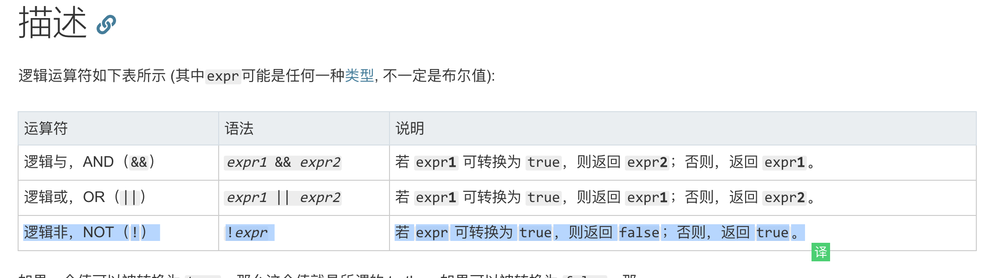

逻辑运算符通常用于布尔型（逻辑）值。这种情况下，它们返回一个布尔值。然而，&& 和 || 运算符会返回一个指定操作数的值，因此，这些运算符也用于非布尔值。这时，它们也就会返回一个非布尔型值。

逻辑与，AND（&&）	expr1 && expr2	若 expr1 可转换为 true，则返回 expr2；否则，返回 expr1。

逻辑或，OR（||）	expr1 || expr2	若 expr1 可转换为 true，则返回 expr1；否则，返回 expr2。

逻辑非，NOT（!）	!expr	若 expr 可转换为 true，则返回 false；否则，返回 true。

### 返回值
排序后的数组。请注意，数组已原地排序，并且不进行复制。
